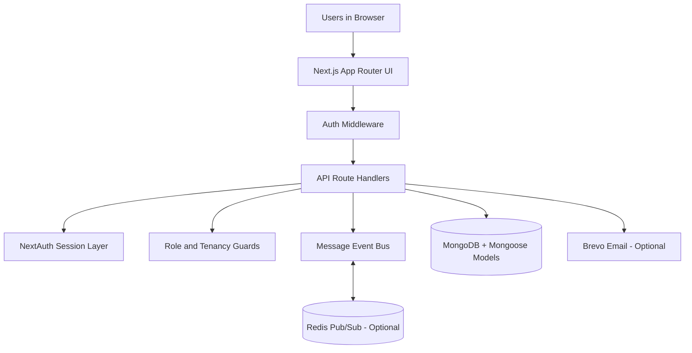

# DreamShift EMS


DreamShift EMS is a private, production-grade team operations system built to manage work from planning to execution.

It brings together:
- workspace and project management,
- task execution and time tracking,
- real-time team messaging,
- calendar workflows,
- notifications,
- and a premium admin command center.

Built and engineered by Navodhya Fernando.

## Features

- Secure authentication and role-aware access control
- Workspace and project lifecycle management
- Task boards with statuses, priorities, subtasks, comments, and deadlines
- Built-in timesheet and task-based time tracking
- Real-time direct and group messaging with reactions and read states
- Calendar and analytics views for planning and performance visibility
- Notification center with live activity context
- Premium admin console for:
	- workspace intelligence,
	- people intelligence,
	- intervention queue,
	- user lifecycle operations (create, edit, offboard)

## Benefits

- Single operating hub: no context switching between disconnected tools
- Better delivery control: clear ownership, status, and execution signals
- Faster team communication: chat with task/project references in the same product
- Manager visibility: operational insights across teams and workspaces
- Scalable architecture: built with modern web stack and modular API design
- Business-ready posture: private proprietary licensing and enterprise-style controls

## Tech Stack

- Frontend: Next.js 16 App Router, React 19, TypeScript
- UI System: custom premium CSS architecture and reusable components
- Backend: Next.js route handlers and server-side business logic
- Authentication: NextAuth credentials flow with JWT sessions
- Data Layer: MongoDB with Mongoose models
- Real-time Layer: Server-Sent Events with Redis pub/sub fanout support
- Email Integration: Brevo support for notification workflows

## Why This Project Reflects My Engineering Profile

- Full-stack ownership from UX to backend architecture
- Real product workflows (not demo-only pages)
- Auth, access control, tenancy checks, and admin-grade controls
- Real-time communication patterns with fallback behavior
- Clean separation of concerns across app, APIs, models, and utilities

## System Architecture

### Architecture Components (with logos)




### How Data Flows (simple view)

1. Users interact with the Next.js frontend.
2. Auth middleware protects private routes before requests proceed.
3. API routes handle business logic (tasks, projects, messaging, admin).
4. Role and tenancy guards enforce who can access what.
5. MongoDB stores persistent business data.
6. Real-time message events are streamed, with Redis support for multi-instance sync.
7. Optional Brevo integration is used for email notifications.

## Repository Structure

```text
dreamshift-ems/
  src/
    app/                 # Next.js pages and API routes
    components/          # Shared UI components
    lib/                 # Auth, DB, roles, events, caching utilities
    models/              # Mongoose schemas
  legacy/                # Legacy Streamlit implementation (archived)
  public/                # Static assets
```

## Quick Start

### Prerequisites

- Node.js 20+
- npm 10+
- MongoDB connection string

### Environment Variables

Create .env.local in the repository root:

```env
MONGODB_URI=mongodb+srv://<username>:<password>@<cluster>/<db>
DB_NAME=dreamshift
APP_SECRET_KEY=<strong-random-secret>

# Optional
REDIS_URL=redis://localhost:6379
BREVO_API_KEY=<brevo-api-key>
BREVO_SENDER_EMAIL=no-reply@your-domain.com
BREVO_SENDER_NAME=DreamShift EMS
```

### Install and Run

```bash
npm install
npm run dev
```

Open http://localhost:3000

### Build and Production Run

```bash
npm run build
npm run start
```

## Key Application Areas

- Home dashboard: cross-system summary and navigation
- Workspaces and projects: planning, ownership, and progress visibility
- Tasks: execution hub with comments, due dates, and tracked effort
- Calendar: schedule perspective on planned and active work
- Messages: real-time direct and group communication with task/project references
- Notifications: personal event stream and unread management
- Profile and settings: personal info, preferences, and account details
- Admin: organization-wide operational intelligence and user lifecycle management

## User Documentation

For role-based workflows and day-to-day usage, see [USER_MANUAL.md](USER_MANUAL.md).

## Security and Access Notes

- Protected application routes are guarded by auth middleware
- Admin routes enforce server-side role checks, including workspace-admin capable access where configured
- Messaging access validates participants/conversation membership on the server

## License

This software is private and proprietary.
See [LICENSE](LICENSE) for usage restrictions.
