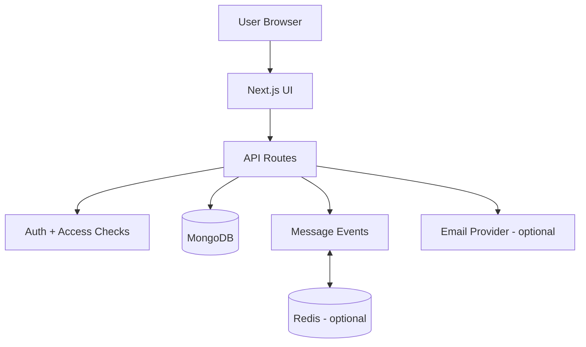

# DreamShift EMS User Manual

This guide explains how to use DreamShift EMS for everyday operations.

## 1. Who This Is For

- Team members managing assigned work
- Workspace and project leads coordinating delivery
- Admins overseeing organization-level operations

## 2. Getting Started

### Sign In

1. Open the sign-in page.
2. Enter your email and password.
3. After login, you will land on the main dashboard.

### Navigation

Use the left sidebar to access:
- Home
- Workspaces
- My Tasks
- Calendar
- Analytics
- Timesheet
- Messages
- Notifications
- Templates
- Profile
- Settings
- Admin (role-based)

## 3. Home Dashboard

The Home page shows high-level metrics and quick links.

Use it to:
- see workload summary,
- monitor current task state,
- jump quickly into projects, tasks, or calendar.

## 4. Workspaces and Projects

### Workspaces

Use Workspaces to organize teams and delivery boundaries.

Typical actions:
- open an existing workspace,
- review members and current activity,
- navigate to linked projects.

### Projects

Inside Projects, you can:
- create and edit projects,
- assign ownership and due windows,
- track progress and completion.

Project pages also support comments and operational context.

## 5. Tasks and Execution

### My Tasks

Use My Tasks to manage personal delivery:
- track task status,
- update priority and deadlines,
- complete subtasks,
- add comments and collaboration notes.

### Task Lifecycle

Common status flow:
- To Do
- In Progress
- In Review (if used)
- Done

### Time Tracking

In the Time page, you can:
- pick a task,
- start/pause tracking,
- persist tracked time into the task,
- review logged hours and top tracked tasks.

## 6. Calendar

The Calendar provides a schedule view of planned work.

Use it to:
- check due items,
- spot upcoming deadlines,
- balance workload across time.

## 7. Messages

Messages supports direct and group chat.

### Core Messaging Features

- Recent chats and people panel
- Direct and group conversations
- Edit, delete, reply, and reactions
- Read/delivery state indicators
- Mention helpers:
  - use # to reference tasks
  - use / to reference projects

### Real-Time Sync

Messages update live through event streaming. If live sync is unavailable,
the app falls back to polling.

## 8. Notifications

The Notifications area shows system and activity updates.

Use it to:
- monitor new events,
- track unread counts,
- jump directly to related entities.

## 9. Profile and Settings

### Profile

- update personal details,
- review activity-related information,
- verify account role and metadata.

### Settings

- configure preferences,
- adjust account behavior,
- manage user-level options exposed in the UI.

## 10. Admin Console (Authorized Roles)

Users with admin-capable roles can access the Admin page.

### What You Can Do

- monitor workspace intelligence,
- review people intelligence and risk signals,
- use intervention queue recommendations,
- open spotlight panels and deeper diagnostics,
- create, edit, and offboard users.

### User Management Safety

Create and edit user flows are separated so new user creation does not overwrite existing users.

## 11. System Architecture (Simplified)

## 12. Troubleshooting

### Cannot Access Admin

- Confirm your account role includes admin-capable access.
- Sign out and sign in again after role changes.

### Messages Not Updating Live

- Check network connectivity.
- The system should automatically switch to polling fallback.

### Avatars Not Showing

- Confirm profile image URL is valid and publicly reachable.
- If image load fails, initials are shown as fallback.

### Date Field Issues

- Use the date picker where provided.
- Ensure values are valid calendar dates.

## 13. Best Practices

- Keep task statuses current to improve analytics quality.
- Track time consistently on active tasks.
- Use task/project mentions in chat to preserve context.
- Review intervention recommendations regularly if you are an admin.

## 14. Support

For operational or access issues, contact your system administrator.
For licensing or deployment questions, contact the repository owner.
